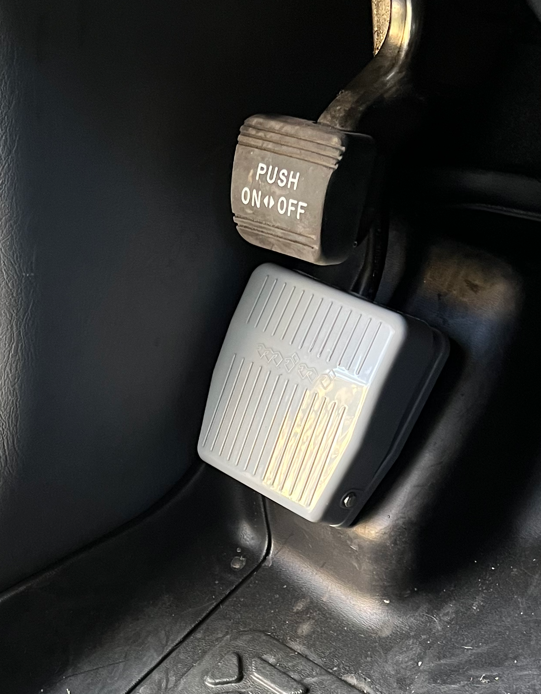

# Foot Horn
Back in "the day", cars use to have their high beam controls by the driver using their left foot on the floor board of the car, pression a small round silver colored switch.  One car I rode in allowed you to change the radio stations with the same type of mechanism.

Driving in California now is "both hands on the wheel" and "one hand ready for the horn".  So using what I saw from the past inspired me to try this first-rev idea out: Honk the horn by pressing on a foot switch using your left foot.

[Switch used at Amazon](https://www.amazon.com/gp/product/B09CV9NQL4)

